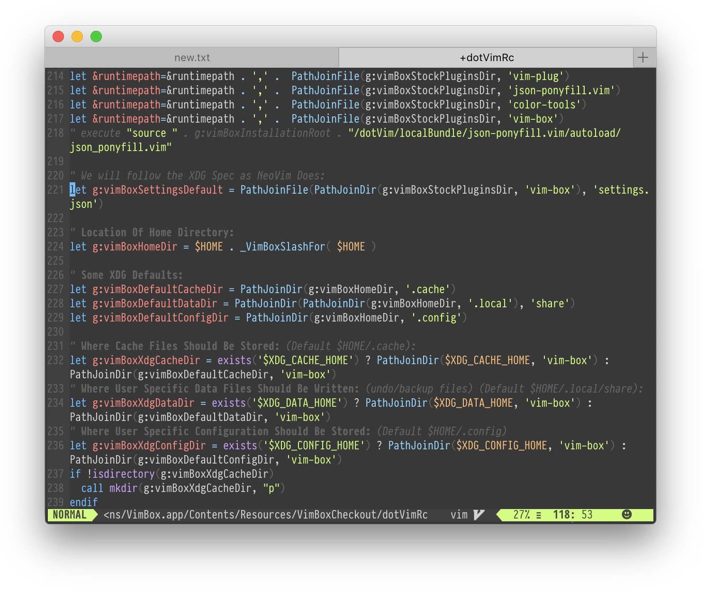
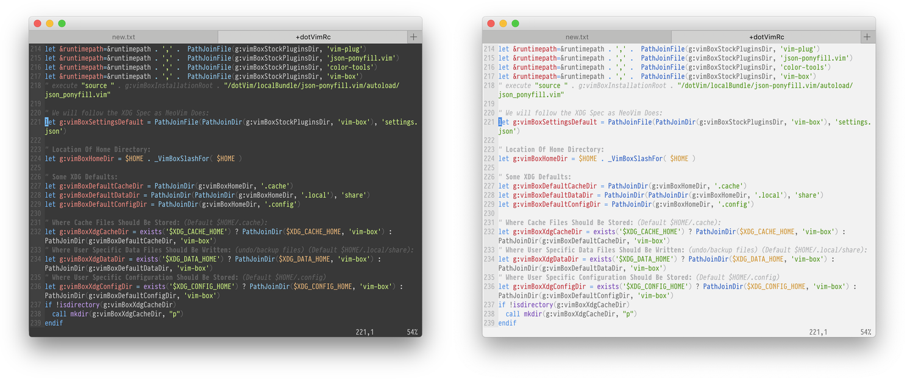
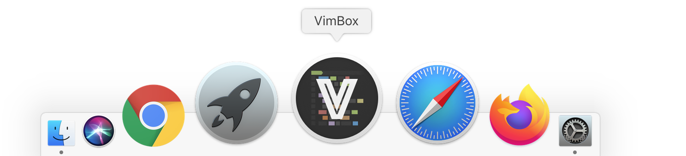
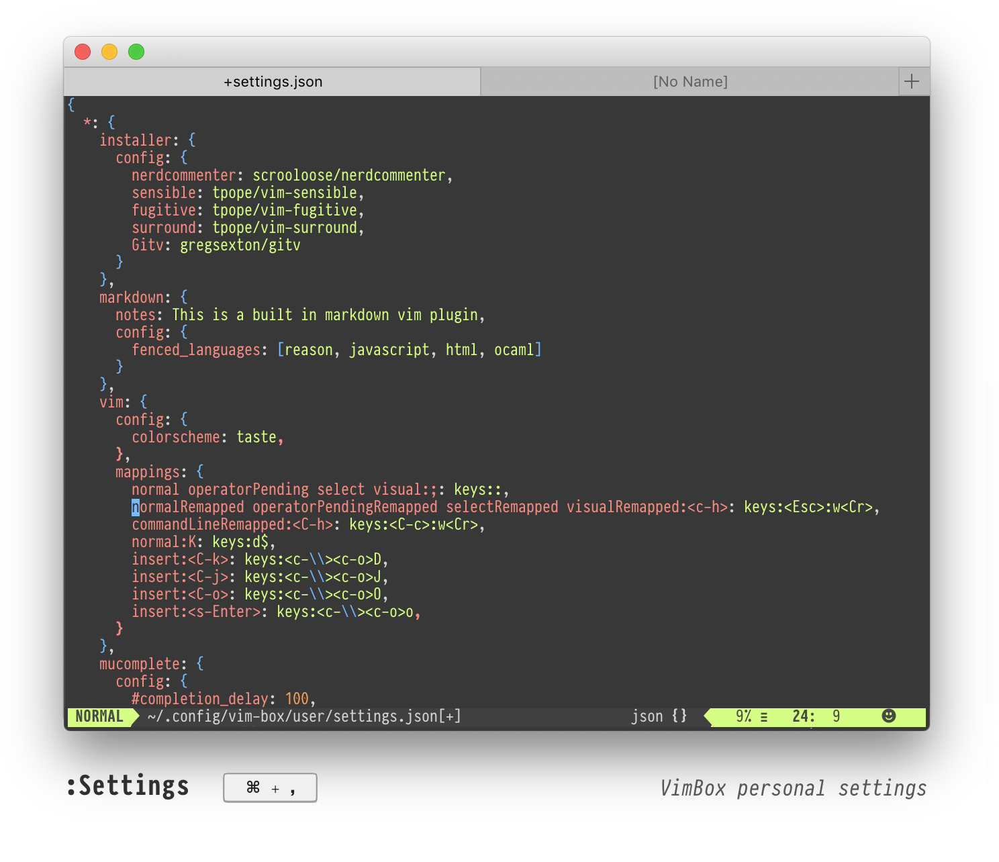
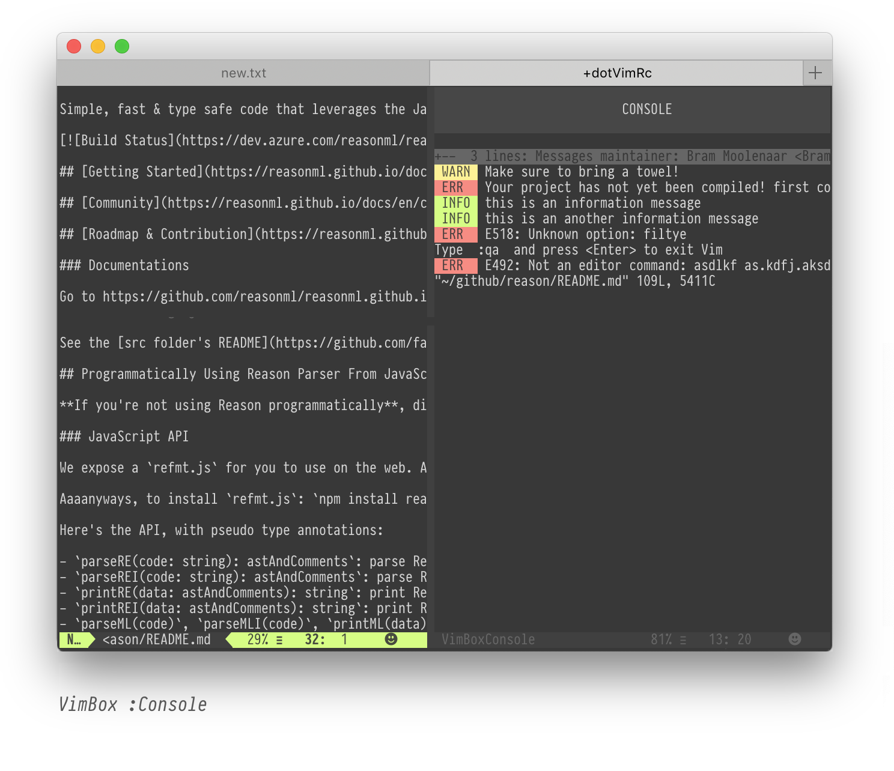
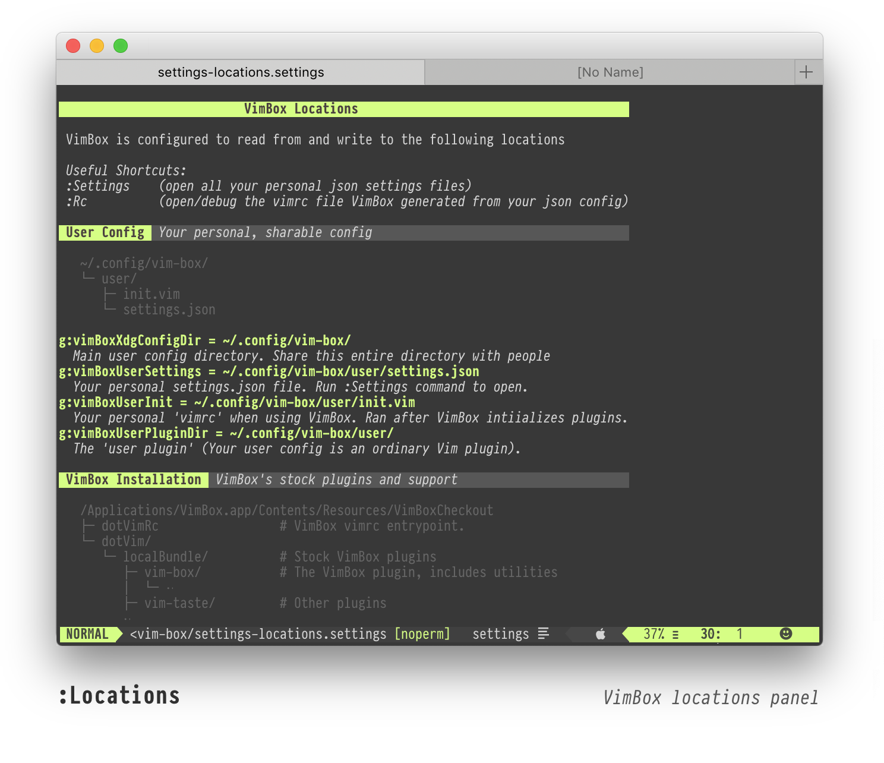
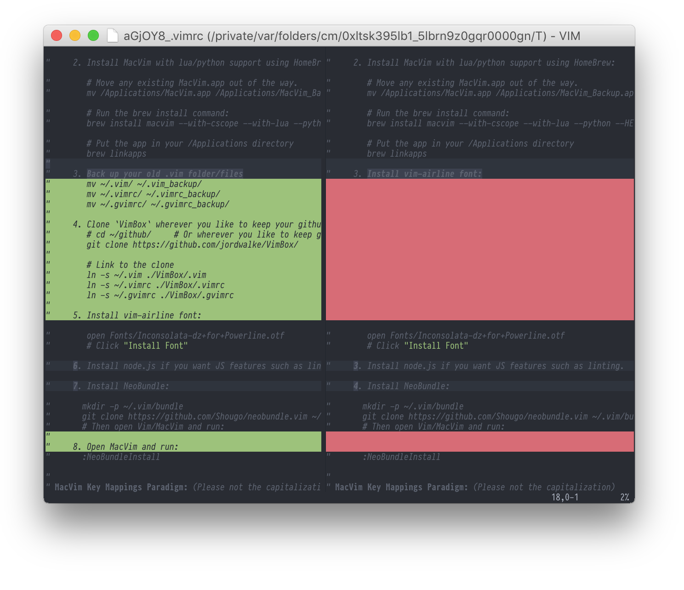

<table width="100%">
<tr>
</tr>

<tr>
<td>
<h2>VimBox</h2>
<blockquote>Modern MacVim Configuration</blockquote>

</td>
<td>
<ul>
  <li><h5>Sane defaults and platformy keybindings</h5></li>
  <li><h5>Layered `.json` based vim configuration</h5></li>
  <li><h5>Automatically generates fast vimrc file</h5></li>
  <li><h5>Try without fear. Doesn't disturb existing Vim configuration.</h5></li>
  <li><h5>(beta)Now with Terminal, Windows, and Linux(gvim) support</h5></li>
</ul>
</td>
</tr>
</table>


<br>




Installation (Mac):
-------------
1. Install [MacVim](http://macvim-dev.github.io/macvim/)
2. [Download a `.zip` of this repo](https://github.com/jordwalke/VimBox/archive/json.zip)
3. Drag `applicationLauncher/VimBox.app` into your `/Applications` folder.
4. Open `/Applications/VimBox.app` (control+click, then select "Open").

It will pull the latest support from this github repo, and then finally it will
ask if you want to install the configured (default) plugins. After doing so,
restart `VimBox.app`  and everything will be setup.

> `VimBox.app` requires that you first install `MacVim.app` (step one), and it
will use that as its basis for installation, but once you open VimBox,
everything VimBox does from that point on is isolated from any existing Vim
installation so you don't need to worry about it messing up your existing Vim
configuration. Try without fear.

  
Features:
----------

### Familiar Mac Key Commands

| Key                                            | Action                                                   |
| ---------------------------------------------- |----------------------------------------------------------|
| <kbd>⌘+,</kbd>                                 | Open personal `.json` based configuration file.          |
| <kbd>⌘+n</kbd>                                 | New Tab                                                  |
| <kbd>⌘+shift+n</kbd>                           | New Window                                               |
| <kbd>⌘+shift+t</kbd>                           | Reopen Last Closed File in current tab                   |
| <kbd>⌘+w</kbd>                                 | Close tab/split:                                         |
| <kbd>⌘+s</kbd>                                 | Save file                                                |
| <kbd>⌘+z</kbd>                                 | Undo                                                     |
| <kbd>⌘+shift+z</kbd>                           | Redo                                                     |
| <kbd>⌘+enter</kbd>                             | Special Distraction-Free FullScreen Mode                 |
| <kbd>⌘+\</kbd>                                 | Toggle File Explorer (Docked `NERDTree`)                 |
| <kbd>⌘+shift+\</kbd>                           | Find current file in file explorer                       |
| <kbd>ctrl+\</kbd>                              | Toggle focus between file explorer                       |
| <kbd>⌘+shift+[</kbd> / <kbd>⌘+shift+]</kbd>    | Go to previous/next tab                                  |
| <kbd>ctrl+tab</kbd> / <kbd>ctrl+shift+tab</kbd>| Go to previous/next tab (in normal Vim mode)             |
| <kbd>⌘+1 </kbd>                                | Go to tab `1`                                            |
| <kbd>⌘+/</kbd>                                 | Toggle comments - selected range - or line               |
| <kbd>⌘+shift+c</kbd>                           | format/indent entire file then restore cursor            |
| <kbd>⌘+d</kbd>                                 | Toggle Diagnostics (errors in location list)             |
| <kbd>⌘+D</kbd>                                 | Toggle QuickFix list                                     |
| <kbd>⌘+r</kbd>                                 | "Run" - invokes pwd/runFromEditor.sh                     |
| <kbd>ctrl+l</kbd>                              | Mega Escape                                              |


> ### Mega Escape
> - <kbd>ctrl+l</kbd> exits insert mode _or_ any modal window/prompt/mode/command to bring you back to normal Vim mode.
> - It's like the home button on the iPhone.
> - Unlike regular `<Esc>`, mega-escape doesn't move your cursor when escaping.
> - Remap <a href="http://stackoverflow.com/questions/15435253/how-to-remap-the-caps-lock-key-to-control-in-os-x-10-8"> CapsLock to control</a> and never reach for `Escape` again. Hit the `CapsLock` key and `l` right on the home row.


### Tasteful colors with matching icon using [`vim-taste`](https://github.com/jordwalke/vim-taste).
  





### User Settings:



The `:Settings` command will open your personal user settings which are stored
in `~/.config/vim-box/user/settings.json`. This settings file can configure
other plugins, including the installation/disabling of other plugins, as well
as configure mappings.

The directory where your `settings.json` file lives is itself a vim plugin -
your own personal vim plugin. It isn't special except that it has the highest
priority. Like any plugin you can define custom utilities/functions/commands
but most people will get by with just editing the `settings.json` file.


### The `:Console`:



The `:Console` command is Vim's missing "Console". It shows errors highlighted
in red. VimBox also exposes `console#error(..)`, `console#warn(..)`, `console#log(..)`,
and `console#info(..)` commands which your plugins can use. Those commands will render
nicely highlighted vim console logs in the VimBox console.
There are also `:Log ..`, `:Warn ..`, `:Error ,.` forms for convenient command mode usage.

You can also vendor that console into your independent plugins. If using VimBox, users
will see nice `:Console` logs - if not, then they will still see beautifully rendered messages
in Vim.


Configuration:
--------------

In VimBox, everything is modelled as a configurable plugin. All stock Vim
plugins work with VimBox, but they just don't make use of VimBox's extra json
configuration feature.
All plugins can optionally include a `settings.json` file in their plugin root
and VimBox will apply the settings specified in it. Any plugin's included
`settings.json` can configure any other plugin. Your personal `settings.json`
is actually just the configuration file for the special `user` plugin - and it
configures other plugins.


Json configuration is of the form:

```json
"my-file-type": {
  "pluginName": {
    "config": {
      "configName": "value"
    },
    "mappings": {
    }
  }
}
```

This enables plugin configurations to only apply to certain filetypes. The fact
that mappings are nested inside of a pluginName, allows those mappings to only
be applied when that plugin `pluginName` is actually installed and activated.
Since VimBox generates the `vimrc` behind the scenes, this is automatic!

In the above example, only for filetype `my-file-type` and if the plugin named
`pluginName` is installed and activated, the value `g:pluginName_configName`
will be set to `"value"`. See the convention? `g:`, plugin name and an
underscore are prepended to the config key. Almost all vim plugins have some
prefix to their global config variables. That's their conventional "plugin
name" that you should use everywhere.


### Configuring Vim Itself:

There's a special plugin called "vim" which allows you to configure vim
settings. When you configure this plugin, there isn't a `g:vim_` prepended to
all your configuration key/values - instead these just set vim settings
directly. For example to configure the vim setting `foldminlines` for all
filetypes, you would do: (note that `"*"` matches all file types).

```json
{
  "*": {
    "vim": {
      "config": {
        "foldminlines": 0,
      },
      "mappings": {
      }
    }
  }
}
```

### Installing Plugins From Github:

To install plugins, configure the "installer" plugin! Then open a new window
and it will install plugins for you. See the "key" of the config? (In this case
`incsearch`?) That's the name of the plugin (that will eventually form the
prefix to configuration values when configuring `incsearch` itself).  I used
`incsearch` as the key string because incsearch expects configuration of the
form: `g:incsearch_XYZ`. Don't worry if you don't know the appropriate plugin
name for automatic prefixing you can always fall back to just specifying the
full `g:whateveryouwant` when it comes time to configure plugins.


```json
{
  "*": {
    "installer": {
      "config": {
        "incsearch": "haya14busa/incsearch.vim"
      }
    }
  }
}
```

#### Mappings:

The mappings system is rad and undocumented.

#### Why json?

> Why go through all this trouble of declarative configuration? So that all the
> configurations can be "resolved" and ties can be broken when multiple plugins
> want to configure the same thing or override a default. Furthermore, in
> VimBox there is a "trace" showing exactly how/why a setting was set based on
> who wanted to apply a setting, and how it got overridden. All of this work is
> done ahead of time and compiled into a compressed vimrc with helpful traces.
> Also, noobs have a really hard time configuring filetype specific
> configurations or bindings.  It's really annoying to get right, so let's just
> automate it based on config.


#### built-in plugins:
- `vimBox`: VimBox sees itself as a configurable plugin named `vim-box`.
  (Recall that "everything is a plugin" in VimBox - that includes VimBox
  itself).
- `vim`: Even vim itself is modeled as a plugin named `vim`. Configuring vim
  settings (such as `incsearch`) is done by configuring the plugin named `vim`.
- `installer`: The plugin which performs installing other plugins. Configuring
  this plugin results in the installation of other plugins.
- `disabler`: The plugin that can disable installation/configuration of other
  plugins.
- `user`: The special plugin that represents "your personal vim setup". It is
  located at `~/.config/vim-box/user/`. It is encouraged that you back this up
  using version control, share it with others on Github, and synchronized it
  between all machines you use.

> Note that plugin names must not contain hyphens since those plugin names end
> up becoming part of variable names. If a plugin is on github under a project
> name like `vim-colors`, usually the "plugin name" in configuration will end
> up being `vimcolors` or `vimColors`.


## More On The User Plugin

The user plugin, located at  `~/.config/vim-box/user/`. All your personal
configuration occurs through this user plugin. And since plugins can configure
other plugins the way you configure everything is by having your user plugin
configure all the other plugins including some special ones like "the vim
plugin".  Also, there is a special plugin called "the installer plugin" and you
install packages by simply having your user plugin configure the installer
plugin. See?  Everything is totally consistent. Everything is a plugin. Want to
disable an installed plugin so it doesn't initialize and none of its attempts
to configure other plugins ever happen? Well then you configure the "disabler
plugin" hahaha.

## Use the User Plugin To Install Local Plugins From FileSystem:
You can place other local plugins not obtained from Github in new directories
inside of `~/.config/vim-box/` for example. Enable them by adding an entry in
your `:Settings`:

```json
"*": {
  "installer": {
    "config": {
      "yourPluginName": "file:~/.config/vim-box/someLocalPlugin/"
    }
  }
}
```

Special VimBox Commands:
------------------------

**Settings**

| Command                   | Action                                                   |
| ------------------------- |----------------------------------------------------------|
| `:Settings`               | Open *All* User **Settings**                             |
| `:SettingsDefaults`       | Open All Default Settings                                |
| `:Rc`                     | Open `.vim` file generated from all `settings.json` files|
| `:Logs`                   | Open VimBox logs. Plugins can append to this log.        |
| `:Locations`              | Panel showing where every important thing is located     |





Git Integration:
---------

#### Setup MergeTool:



Resolving merge conflicts is simple with `VimBox`. Just put this in your `~/.gitconfig`.


Now, `git mergetool` will resolve rebase and merge conflicts directly inside of `MacVim`.


      [mergetool]
        keepBackup = false
        keepTemporaries = false
        prompt = false
      [mergetool "mvimmerge"]
        cmd="/Applications/VimBox.app/Contents/Resources/VimBoxCheckout/applicationPatches/box -g -f '+windo set diff scrollbind scrollopt+=hor nowrap' -c 'Gvdiff' $MERGED"     # use fugitive.vim for 3-way merge
        # cmd="mvim -c 'Gdiff' $MERGED"     # use fugitive.vim for 3-way merge
        keepbackup=false


#### Setup Commit Message Editor:

Make sure to tell your shell that `MacVim` is the way that you'd like to edit commit messages. This special command will ensure that when you close your `MacVim` window, you will return back to the command line `iTerm`. Replace with your shell rc file and terminal app name.


    echo export EDITOR='mvim -f --nomru -c "au VimLeave * !open -a iTerm"' >> ~/.bashrc
    echo export GIT_EDITOR='mvim -f --nomru -c "au VimLeave * !open -a iTerm"' >> ~/.bashrc


Uninstalling:
-------------
- Just remove `/Applications/VimBox.app`.
- VimBox shouldn't have touched anything in your regular Vim config.
- There are some `vim-box` data directories that it has written to with your
  personal configuration in various places in your home directory (XDG
  compliant). Run `:Locations` to see where it places things.


License:
-------

See the license file included. Any dependencies that are included in `VimBox`
may have their own license. In the event any dependency is include in `VimBox`,
an attempt has been made to also include its corresponding license in the
directory containing that licensed work. See `ORIGINS.md`.

ORIGINS:
--------

See [./ORIGINS.md](ORIGINS.md) for information on where various pieces of this
repo came from. Some libraries inside this repo merely for convenience and
those retain their own licenses.
