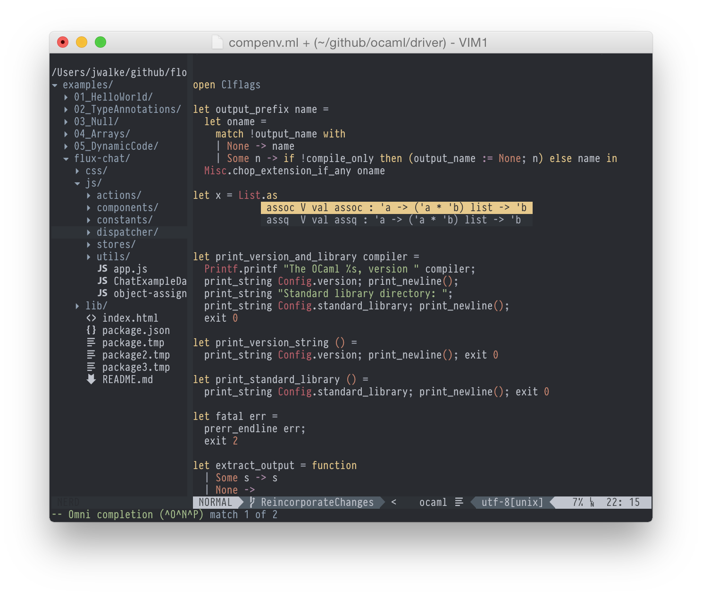
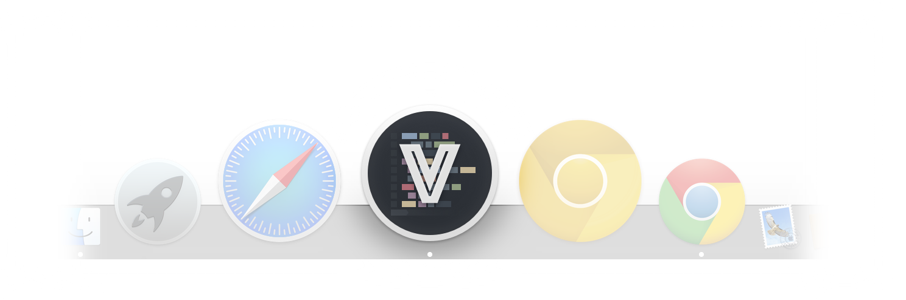

<table width="100%">
<tr>
</tr>

<tr>
<td>
<h2>VimBox</h2>
<blockquote>Modern MacVim Configuration</blockquote>

</td>
<td>

<ul>
  <li><h5>Mac Keyboard mappings</h5></li>
  <li><h5>Familiar autocomplete behavior</h5></li>
  <li><h5>JavaScript indentation and lint support</h5></li>
  <li><h5>Snippets (with JavaScript examples)</h5></li>
  <li><h5>Spacegray theme with matching app icon.</h5></li>
</ul>
</td>
</tr>
</table>


<br>

> VimBox with Spacegray colorscheme



> VimBox's matching application icon




Installation:
-------------
> Quickly try VimBox in place of your existing setup. Back up your existing vim files, and move them out of the way as instructed:

1. If you already have a vim setup, move it safely out of the way or back it up.

        mv ~/.vim ~/.vim_backup    #No trailing slashes to preserve symlinks!
        mv ~/.vimrc ~/.vimrc_backup
        mv ~/.gvimrc ~/.gvimrc_backup


2. You *Must* Install a Recent Version of MacVim: (Snapshot 72 or above) (with python support)

        Lion/Mountain Lion: Snapshot 72:
        https://github.com/eee19/macvim/releases

        Mavericks: Snapshot 72 here:
        https://github.com/b4winckler/macvim/releases

        # Alternatively, if you'd rather install via `brew`
        brew install macvim --with-cscope --python --HEAD
        brew linkapps    # Put the app in your /Applications directory

3. Clone `VimBox` wherever you like to keep your github clones

        # cd ~/github/     # Or wherever you like to keep github clones
        git clone https://github.com/jordwalke/VimBox/
        ln -s `pwd`/VimBox/dotVim ~/.vim      # Link to the cloned vim config
        ln -s `pwd`/VimBox/dotVimRc ~/.vimrc
        ln -s `pwd`/VimBox/dotGVimRc ~/.gvimrc

4. Start `MacVim` that you just installed. Confirm that you want to install bundles. If it asks you to hit any key to continue, just keep hitting enter. Restart `MacVim` when it's finished.

5. `[Recommended]` Install the included vim-airline font so `VimBox` looks like
   the screenshot with the `vim-airline` bar. From the command line:

        open ./VimBox/dotVim/Fonts/InconsolataDz/Inconsolata-dz\ for\ Powerline.otf # Then click "Install Font"

6. Install up-to-date node.js if you want JS linting (http://nodejs.org/)

7. Make your MacVim use the VimBox icon (optional):

```lang=bash
open /Applications/
# Find the MacVim app icon and press `⌘+i` to open the information window
open ./dotVim/images
# drag the ApplicationIcon.icns onto the little icon in the information window
# and restart MacVim.
```
  
  
Features:
----------

#####Familiar Mac Key Commands

| Key                       | Action                                          |
| ------------------------- |-------------------------------------------------|
| `⌘+p`                     | Open Anything (`ctrl-p`)                        |
| `⌘+n`                     | New Tab                                         |
| `⌘+shift+n`               | New Window                                      |
| `⌘+shift+t`               | Reopen Last Closed Tab                          |
| `⌘+w`                     | Close tab/split: Opens to the left (like Sublime) not right (like vim)  |
| `⌘+s`                     | Save file                                       |
| `⌘+z`                     | Undo                                            |
| `⌘+shift+z`               | Redo                                            |
| `⌘+enter`                 | Special Distraction-Free FullScreen Mode        |
| `⌘+e`                     | Toggle File Explorer (Docked `NERDTree`)        |
| `⌘+shift+[` / `⌘+shift+]` | Go to previous/next tab                         |
| `^+tab` / `^+shift+tab`   | Go to previous/next tab (in normal Vim mode)    |
| `⌘+1 `                    |                 Go to tab `1`                   |
| `F5`                      | Sort lines (like Textmate)                      |
| `⌘+shift+p`               | Toggle spell-check                              |
| `⌘+/`                     | Toggle comments - selected range - or line      |
| `⌘+shift+m`               | format/indent entire file then restore cursor   |
| `⌘+shift+r`               | Toggle error list (only shows if it has errors) |
| `⌘+r`                     | Toggle quickfix list                            |


#####Mega Escape
> - `VimBox` has mapped `^+l` to exit out of any modal window/prompt/mode/command to bring you back to normal Vim navigation mode.
> - It's like the home button on the iPhone.
> - Unlike regular `<Esc>`, mega-escape doesn't move your cursor when escaping.
> - Remap <a href="http://stackoverflow.com/questions/15435253/how-to-remap-the-caps-lock-key-to-control-in-os-x-10-8"> CapsLock to control</a> and never reach for `Escape` again. Hit the `CapsLock` key and `l` right on the home row.

| Key          | Action      |
| ------------ |-------------|
| `^+l`        | Mega Escape |

#####Airline/Spacegray

`VimBox` includes `vim-airline` and `Spacegray` color scheme.

#####Braces and Pairs

- Inserting `{`, `[`, `'`, or `"` automatically inserts the closing character.
- When hitting enter with the cursor between two braces `{|}` the newline is formatted with an extra indentation.
- The behavior is identical to Sublime/Textmate.

#####AutoComplete/Snippets

- Completions pop up automatically.
- Like Sublime, `VimBox` accepts highlighted entries via `tab` or `enter`.
- `tab` also triggers a snippet when applicable, and `tab` will allow "tabbing" through the snippet placeholders.
- Place custom snippets in `~/.vim/myUltiSnippets/`
- If the completion window is open and you want to insert a newline instead of inserting the completion, press `shift+enter` or `control+enter`.


#####Distraction Free UI Tabs

- When not in full screen mode, Mac style metalic tabs are used.
- When in full-screen mode, those tabs become flat and blend into the background so you can focus on the code.


#####One File, One Location

Included plugins are configured so that opening a file will always focus the window/tab/split where that file is already open. This is how most modern editors work.

#####Many Plugins, One Interaction Language

Multiple plugins (`ctrl-p` and `NERDTree`) have been configured so that they have consistent keyboard mappings. For example, `s` represents the notion of a "vertical split", and `h` represents horizontal in both plugins (though one plugin might require a `ctrl` modifier in some cases.)

#####Command-P Search Window

The `ctrl-p` plugin has been configured to "do the right thing", which means searching for some combination of recently used files and/or the contents under the current working directory. It caches the results, but if you open it from your home directory, it could take a while to scan your entire directory.

| Key          | Action        |
| ------------ |-------------|
| `⌘+p`       | Open Anything and begin searching for file|
| `enter`      | While searching, opens the top hit in new tab or jump to existing window if already open |
| `c-s`        | While searching, opens the top hit in a vertical split or jump to existing window if already open |
| `c-h`        | While searching, opens the top hit in horizontal split or jump to existing window if already open |
| `⌘+shift+c`  | While searching, refreshes the search results if files have changed on disk|
| `ctrl+c`     | Kills a slow search |

#####NERDTree

`NERDTree` is included and is configured to act as a left-nav bar (toggle it via `⌘+e`). Its keymappings have been configured to be consistent with the `ctrl-p` plugin.

| Key          | Action        |
| ------------ |-------------|
| `⌘+e`       | Toggle side bar file explorer |
| `⌘+E`       | Reveal current file in side bar file explorer |
| `j`/`k`      | While explorer focused, move up and down |
| `enter`      | While explorer focused, opens a file in new tab or jump to existing window if already open |
| `s`          | While explorer focused, opens a file in a vertical split or jump to existing window if already open |
| `h`          | While explorer focused, opens a file in horizontal split or jump to existing window if already open |
| `u`          | While explorer focused, Move up a directory |
| `o`          | While explorer focused, Expand a subdirectory |
| `CD`         | While explorer focused, Make the file explorer's directory equal to Vim's `cwd`  |
| `cd`         | While explorer focused, make Vim's `cwd` equal to the directory under the cursor |
| `m`         | While explorer focused, show complete menu of possible commands to execute |


#####Tabs And Splits Navigation
> Jump around quickly to the next tab or split with a single key press. Go back the other direction by pressing shift.

| Key          | Action        |
| ------------ |-------------|
| `Space`/`shift+Space`       | While in Vim's normal mode - go to next/preious tab |
| `tab`/`shift+tab`      | While in Vim's normal mode - go to next/previous split |


####JavaScript Development

#####JavaScript Linting
- Excellent JavaScript indenting and inline linting with support for `JSX`.
- Syntax error highlighting via Syntastic.
- Type error highlighting via `flow`. Just have `flow` installed on your path, and type/syntax errors will be underlined in red. As always, hit `⌘+l` to toggle the summary of the file's errors.


#####JavaScript Snippets
- JavaScript snippets are include, but you can add your own for any language you like

| Key          | Action        |
| ------------ |-------------|
| `for` `tab`  | `for` loop |
| `if`       | `if` statement|
| `forin` `tab`| `for`-`in` loop |
| `fun` `tab`| `function` definition |
| `lam` `tab`| Lambda function |
| `try` `tab`| `try`/`catch` |
| `log` `tab`| `console.log` |
| `logo` `tab`| Log stringified object to console |
| `tag` `tab`| `JSX` tag `<typeHere att={}></typeHere>`|
| `logo` `tab`| Many more including <a href="https://github.com/facebook/react">ReactJS</a> helpers |


#####JavaScript DocBlock Generator

The following key mapping generates docblock comments. `<tab>` will select the parameters in the generated docblock so you can edit the descriptions/types. Works with `ES6` functions.

| Key          | Action        |
| ------------ |-------------|
| `⌘+shift+c` | Generate JS Docblock  - when cursor is above a function|


Git Integration:
---------

#####Setup DiffTool:

Any result of a `git diff` command can be viewed in a side-by-side diff view inside of `MacVim`. All of your familiar `vim` key commands work while browsing your diff. Place this in your `~/.gitconfig`:

        [diff]
            tool = default-difftool
        [difftool "default-difftool"]
            cmd = "~/.vim/mvimgitdiff.sh " $LOCAL $REMOTE

Now you can use the `git difftool` command exactly like you use `git diff`, but a MacVim window will appear:


#####Setup MergeTool:

Resolving merge conflicts is simple with `MacVim`. Just put this in your `~/.gitconfig`.

        [mergetool]
          prompt = false
          # See bashrc for exporting the editor across all apps, not just git.
        [mergetool "mvimdiff"]
          cmd="/Applications/MacVim.app/Contents/MacOS/Vim -g -f '+windo set diff scrollbind scrollopt+=hor nowrap' -c 'Gdiff' $MERGED -c 'au VimLeave * !open -a iTerm'"
          # cmd="mvim -c 'Gdiff' $MERGED"     # use fugitive.vim for 3-way merge
          keepbackup=false

        [merge]
          tool = mvimdiff


Now, `git mergetool` will resolve rebase and merge conflicts directly inside of `MacVim`.


#####Setup Commit Message Editor:

Make sure to tell your shell that `MacVim` is the way that you'd like to edit commit messages. This special command will ensure that when you close your `MacVim` window, you will return back to the command line `iTerm`. Replace with your shell rc file and terminal app name.


    echo export EDITOR='mvim -f --nomru -c "au VimLeave * !open -a iTerm"' >> ~/.bashrc
    echo export GIT_EDITOR='mvim -f --nomru -c "au VimLeave * !open -a iTerm"' >> ~/.bashrc


Plugin System:
---------

`VimBox` achieves its features through configuration of several plugins, but those should be considered implementation details of the `VimBox` distribution. `VimBox` uses modern editors as a "spec" for features and will configure several plugins in order to conform to that spec.

- You can add any plugin you like using the `NeoBundle` command.
- Add custom plugins using the `NeoBundle` command inside
  `~/.vim/bundlesVimRc.custom`.
- Customize `~/.vim/vimrc.custom.before` to configure Vim before any of the
  bundles are loaded, and customize `~/.vim/vimrc.custom.after` to configure
  Vim after plugins are loaded.


Customizing:
---------
In `~/.vim/vimrc.custom.before`/`~/.vim/vimrc.custom.after` you may set any options you like. (See "Plugin System" section above).

`VimBox` will look to see if you have defined the following variables defined in your `~/.vim/vimrc.custom.before`:

| Key                      | Behavior                |
| ------------------------ |-------------------------|
| `let g:textColumns = 82` | Set text wrapping width |
| `let g:tabSize = 2`      | Set tab width           |


Using VimBox's configuration from NeoVim
---------

    mkdir ~/.config
    ln -s ~/.vim ~/.config/nvim
    ln -s ~/.vimrc ~/.config/nvim/init.vim

License:
-------

See the license file included. Any dependencies that are included in `VimBox`
may have their own license. In the event any dependency is include in `VimBox`,
an attempt has been made to also include its corresponding license in the
directory containing that licensed work.

Each of the fonts carry their own license, which you should consult.

The VimBox application icon was derived from [Jannik Siebert](https://dribbble.com/janniks)'s excellent [Sublime
icon](https://dribbble.com/shots/1827862-Yosemite-Sublime-Text-Icon). See the icon's `README` for more information and links to the original
works as well as the license that applies to that icon.

The SketchApp sources to the icon are also included in the
`dotVim/images/iconSources` folder.
