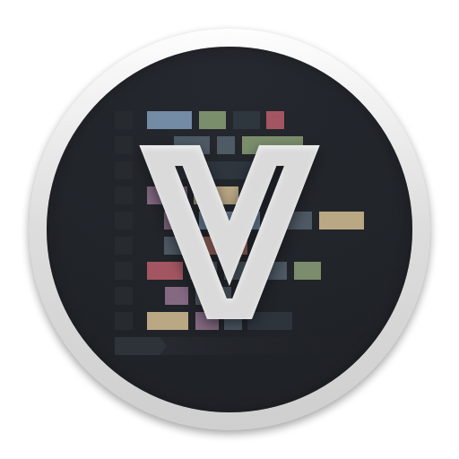

VimBox
======

A modern setup for MacVim.

Installation:

     1 Install HomeBrew if needed.

         http://brew.sh/

     2. Install MacVim with lua/python support using HomeBrew:

        # Move any existing MacVim.app out of the way.
        mv /Applications/MacVim.app /Applications/MacVim_Backup.app

        # Run the brew install command:
        brew install macvim --with-cscope --with-lua --python --HEAD

        # Put the app in your /Applications directory
        brew linkapps

     3. Back up your old .vim folder/files
        mv ~/.vim/ ~/.vim_backup/
        mv ~/.vimrc/ ~/.vimrc_backup/
        mv ~/.gvimrc/ ~/.gvimrc_backup/

     4. Clone `VimBox` wherever you like to keep your github clones
        # cd ~/github/     # Or wherever you like to keep github clones
        git clone https://github.com/jordwalke/VimBox/

        # Link to the clone
        ln -s ~/.vim ./VimBox/.vim
        ln -s ~/.vimrc ./VimBox/.vimrc
        ln -s ~/.gvimrc ./VimBox/.gvimrc

     5. Install vim-airline font:

        open Fonts/Inconsolata-dz+for+Powerline.otf
        # Click "Install Font"

     6. Install node.js if you want JS features such as linting.

     7. Install NeoBundle:

       mkdir -p ~/.vim/bundle
       git clone https://github.com/Shougo/neobundle.vim ~/.vim/bundle/neobundle.vim
       # Then open Vim/MacVim and run:

     8. Open MacVim and run:
       :NeoBundleInstall

