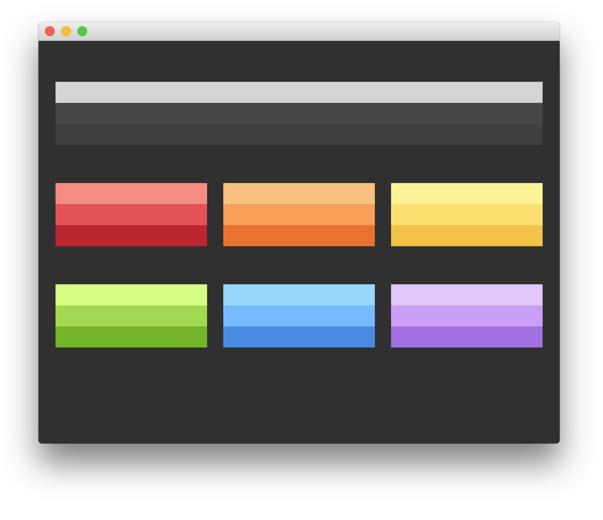
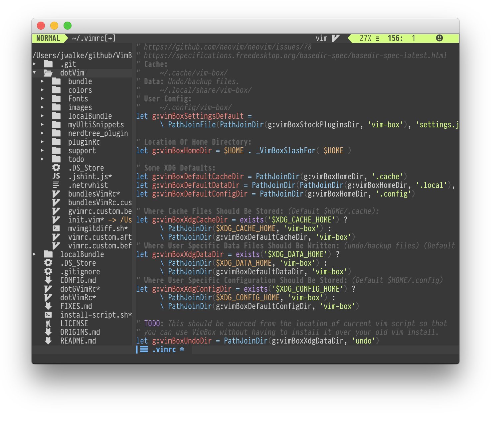
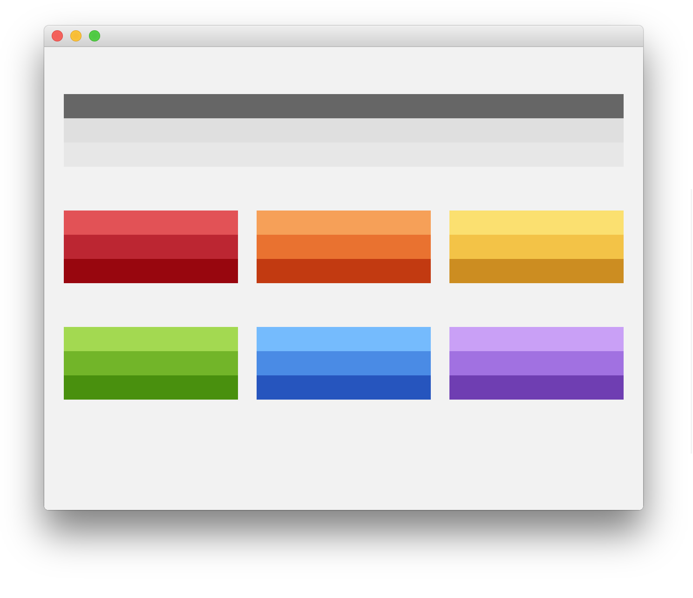
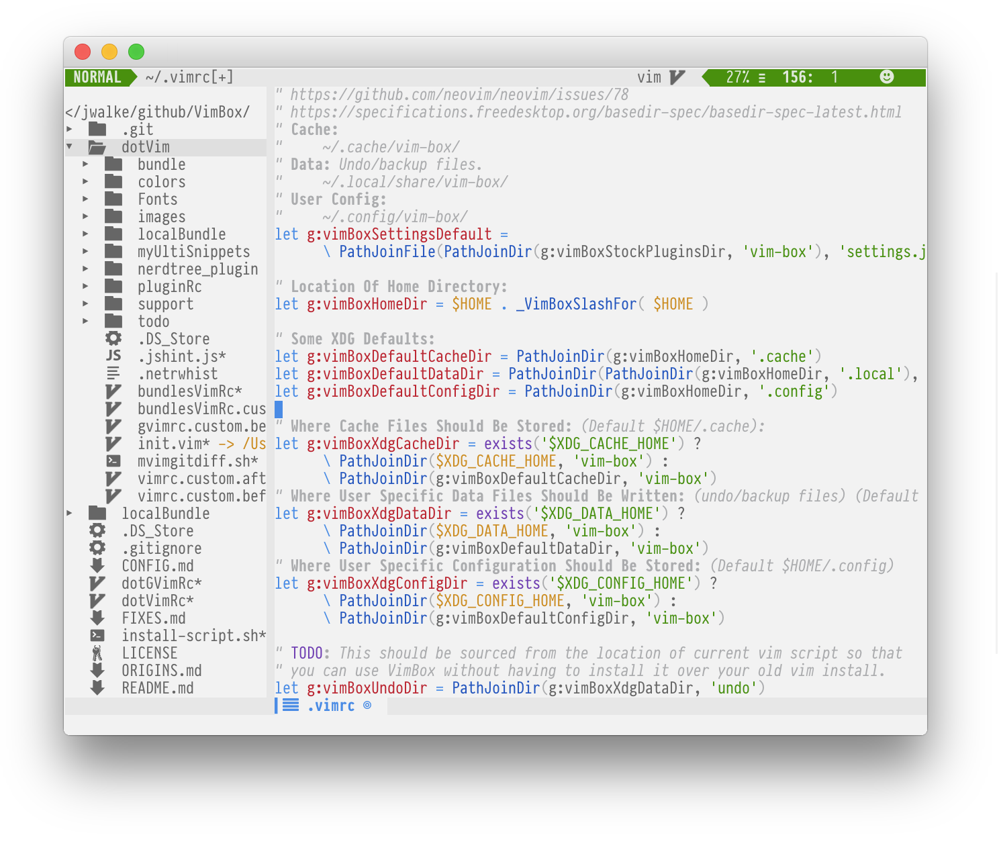

# vim-taste

> Light and dark vim colorscheme, based on [elementary OS Brand](https://elementary.io/brand) colors.






Supports *true colors* and falls back gracefully and automatically if your
environment does not support this feature.

### Vim Airline theme

Add the following line to your `~/.vimrc` or `~/.config/nvim/init.vim`

```vim
let g:airline_theme='taste'
```

This theme comes with light and dark flavors. You can toggle between the two
via `set background=light` or `set background=dark`.


### List of enhanced language support

Pull requests are more than welcome here.
I have created few issues to provide a bare bone roadmap for this color
scheme.

* Asciidoc
* Cucumber features
* CSS and Sass
* Elixir
* HTML
* JavaScript, JSON
* Markdown
* Ruby
* Vim
* XML
* Go


### Installation

You can use your preferred Vim Package Manager to install **taste**.

### Usage

**taste** comes in two flavors: light and dark, make sure to properly set your `background` before setting the colorscheme.

```vim
set background=dark " for the dark version
" set background=light " for the light version
colorscheme taste
```

#### Italic support

Some terminals do not support italic, cf. [#3][issue_3].

If your terminal does support _italic_, you can set the `g:taste_allow_italics` variable to 1 in your `.vimrc` or `.config/nvim/init.vim`:

```vim
set background=light        " for the light version
let g:taste_allow_italics = 1 " I love italic for comments
colorscheme taste
```

iTerm2 can support italic, follow the instructions given in this [blog post by Alex Pearce](https://alexpearce.me/2014/05/italics-in-iterm2-vim-tmux/).
Make sure to read the update if you are using tmux version 2.1 or above.

#### True color support
To benefit from the **true color** support make sure to add the following lines in your `.vimrc` or `.config/nvim/init.vim`

```vim
"Use 24-bit (true-color) mode in Vim/Neovim when outside tmux.
"If you're using tmux version 2.2 or later, you can remove the outermost $TMUX check and use tmux's 24-bit color support
"(see < http://sunaku.github.io/tmux-24bit-color.html#usage > for more information.)
if (empty($TMUX))
  if (has("nvim"))
  "For Neovim 0.1.3 and 0.1.4 < https://github.com/neovim/neovim/pull/2198 >
  let $NVIM_TUI_ENABLE_TRUE_COLOR=1
  endif
  "For Neovim > 0.1.5 and Vim > patch 7.4.1799 < https://github.com/vim/vim/commit/61be73bb0f965a895bfb064ea3e55476ac175162 >
  "Based on Vim patch 7.4.1770 (`guicolors` option) < https://github.com/vim/vim/commit/8a633e3427b47286869aa4b96f2bfc1fe65b25cd >
  " < https://github.com/neovim/neovim/wiki/Following-HEAD#20160511 >
  if (has("termguicolors"))
    set termguicolors
  endif
endif


set background=dark " for the dark version
" set background=light " for the light version
colorscheme taste
```


I've tested the following setup on a Mac:

* iTerm2 nightly build
* Neovim 0.1.4 and 0.1.5-dev
* Vim 7.4.1952

[logo-mac]: screenshots/logo-mac.png
[logo-light]: screenshots/logo-light.png
[logo-light-mac]: screenshots/logo-light-mac.png
[screenshot-dark]: screenshots/dark.png
[screenshot-light]: screenshots/light.png


### Origins:

See [ORIGINS.md](./ORIGINS.md)

This project is a fork of @jordwalke's
[vim-one](https://github.com/jordwalke/vim-one) plugin which is a fork of
`@rakr`'s [vim-one](https://github.com/rakr/vim-one) plugin which is a fork of
another vim plugin.
